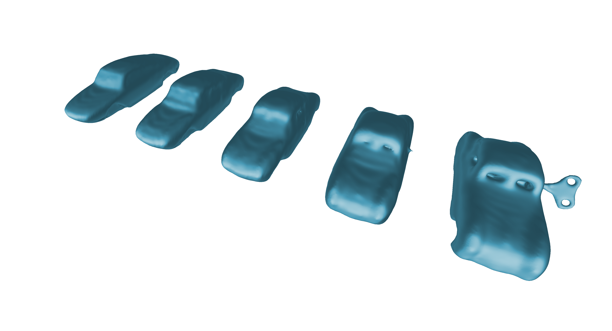

# H.U.R.B.A.N. selector

[](https://dev.azure.com/subdgtl/HURBAN-Selector/_build/latest?definitionId=1&branchName=master)

H.U.R.B.A.N. selector is a software experiment sponsored by the [Slovak
Design Center](https://www.scd.sk/). It is meant to test the
hypothesis that creating new designs and shapes is subconsciously
inspired by our previous experience. There is a trial and error phase
in the design process where many variations on the same shape are
prototyped and chosen from.

The software is currently in very early stages, but as it nears
completion, it will strive to be a tool for simple parametric
modeling, containing implementations of various hybridization
strategies for mesh models, allowing designers to smoothly interpolate
between multiple mesh geometries and select the result with the most
desired features.



## Getting the software

Currently the only option is to build from source (see development
guide down below).

## Developing

Make sure you have the following installed:

- [Rust](https://rustup.rs/)
- Clippy (`rustup component add clippy`)
- Rustfmt (`rustup component add rustfmt`)
- [Dependencies for `shaderc-sys`](https://github.com/google/shaderc-rs#building-from-source)

We use standard `cargo` workflows:

- `cargo clippy` to have a nice chat with 📎, the linter,
- `cargo fmt` to format the project,
- `cargo test` to run tests,
- `cargo doc --open` to build and open local documentation for the
  project and all dependencies (optionally pass
  `--document-private-items`),
- `cargo build` to build,
- `cargo run` to run.

### Testing

Apart from unit and integration tests, we do have a fair amount of
snapshot tests. These are used mostly to check for regressions in
operation implementations. The workflow is to always manually review
the new snapshot, if the operation's output has changed.

Snapshots are handled by the
[insta](https://docs.rs/insta/0.12.0/insta/) crate. The `cargo insta`
plugin, while not strictly necessary, is also useful in the
workflow. Get it with `cargo install cargo-insta`.

To make a new snapshot test, add a standard test and use
`insta::assert_json_snapshot("name_of_snapshot", &data)`. The test
will fail at first, as there is no snapshot to compare against. Use
the `cargo insta review` to review snapshot diffs or new snapshots.

### Environment Variables

Optionally configure one of the following:

**HS_THEME**: Either `dark` or `funky`. Default is `dark`.

**HS_MSAA**: Choose the number of multisampling samples. Either 1, 2,
  4, 8, or 16. Default is 1.

**HS_VSYNC**: Enable (1) or disable (0) VSync. Default is enabled.

**HS_GPU_BACKEND**: Force a GPU backend. A gpu backend is
  automatically selected, but optionally a non-default gpu backend can
  be specified. Can take the following values:

- `vulkan` on Windows, Linux, or macOS with VulkanSDK,
- `d3d12` on Windows,
- `metal` on macOS.

Default is primary GPU backend for the current OS.

**HS_GPU_POWER_PREFERENCE**: Choose power preference used to select a GPU to run
  on. Either `low-power` or `high-performance`. Default defers the decision to
  the GPU backend.

**HS_APP_LOG_LEVEL**: Set level of logging for the editor. Either
  `error`, `warn`, `info` or `debug`. Default is `debug`.

**HS_LIB_LOG_LEVEL**: Set level of logging for external crates. Either
  `error`, `warn`, `info` or `debug`. Default is `warn`.

### Renderer development

If working on the renderer, Vulkan validation layers can provide additional
validation. When running on the Vulkan backend and with `debug_assertions`
enabled, `gfx-hal` automatically enables Vulkan validation layers.

For the implementation to be able to load the validation layers, the [LunarG
Vulkan SDK](https://vulkan.lunarg.com/) must be installed. Note that the Vulkan
SDK can even be installed on macOS, and enables running on the Vulkan backend
there, but the setup is a bit more involved - see macOS guide in
[ash](https://crates.io/crates/ash)), and possibly [disable
SIP](http://osxdaily.com/2015/10/05/disable-rootless-system-integrity-protection-mac-os-x/)

### Creating a windows distribution for workshops

- `cargo build --release`,
- create a distribution directory in a place of your heart's desire,
- copy `./target/release/hurban_selector.exe` to the distribution directory,
- add the following `run.cmd` file to the distribution directory:

```cmd
REM Set environment variables here
set HS_THEME=funky
hurban_selector.exe
```

Before running on target computer, make sure "Microsoft Visual C++
Redistributable for Visual Studio 2019" is installed (get it
[here](https://support.microsoft.com/en-us/help/2977003/the-latest-supported-visual-c-downloads))

### Creating a Windows installer

Refer to [installer's readme](installer/README.md) to create Windows installer.

### Licence

The editor source code is provided under the GNU GENERAL PUBLIC
LICENSE, Version 3. If the research or implementation yields
interesting results, those will be extracted from the editor and
published and licensed separately, most likely under a more permissive
license such as MIT.
